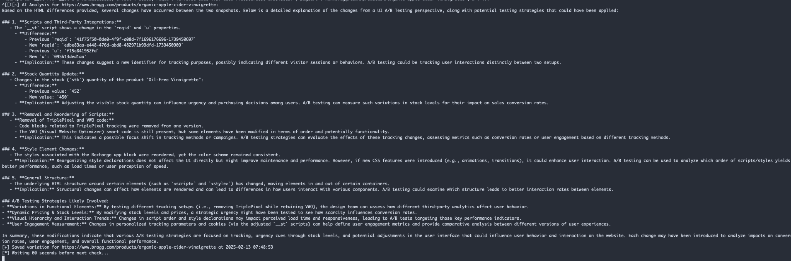
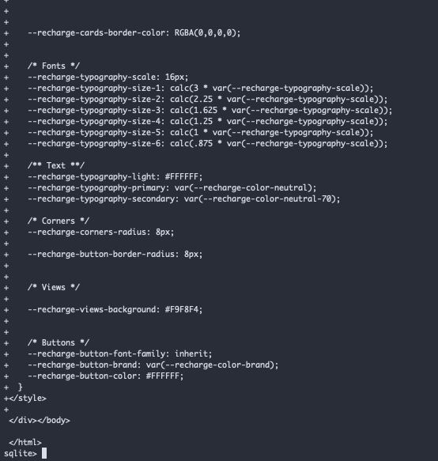

# VWO Site Analyzer

VWO Site Analyzer is a tool designed to monitor popular websites and analyze how they implement A/B testing. By tracking and comparing full HTML snapshots of web pages, this tool helps you understand the variations in A/B tests (such as those run with VWO, Google, or other platforms) so you can improve your own testing strategies and make informed decisions.

## Analysis Example




Notices that the stock quantity displayed is one of the A/B tests for a site. Some companies will use this for urgency to encourage buying.



Able to scan DB to see actual HTML differences between base site and it's variations


## Video Explanation

[Video Link](https://www.loom.com/share/3a9925a2893642eab8bf1a5060bac28f?sid=f95bc6d8-78bb-4f09-be9c-5a1eab01ce6a)

## Why This Project?

Understanding how popular sites run their A/B tests can be key to optimizing your own experiments. This project was developed with the following goals in mind:
- **Insights and Analysis:** Compare HTML snapshots of websites to identify changes that may indicate A/B testing strategies.
- **Fast** Use OpenAI's 4o-mini model to quickly analyze differences in HTML and provide actionable insights.
- **Flexibility:** While the focus is on VWO, this code can be extended to analyze other types of A/B testing (e.g., Google experiments).
- **Persistent Storage:** The use of an SQLite database, although not optimal for large-scale data storage, provides a quick and persistent solution to archive HTML snapshots and analysis results.

## Features

- Monitors specific web pages for changes in HTML.
- Extracts potential A/B testing elements (e.g., elements with `data-vwo` attributes).
- Compares HTML snapshots to identify differences.
- Uses OpenAI's 4o-mini model to generate insights based on the HTML differences.
- Saves all data—including full HTML, HTML differences, and analysis results—into an SQLite database.
- Supports joining base pages with their variations for easier tracking.

## Requirements

- Python 3.7+
- Required Python packages are listed in the `requirements.txt` file.

## Installation

1. **Clone the Repository:**

   ```bash
   git clone https://github.com/RaymondRJones/VWO-Analysis-Tool.git
   cd VWO-Analysis-Tool
   ```

2. **Install Dependencies**

`pip install -r requirements.txt`

3. **Configure API Key**

Must place your own OpenAI API key inside
## Usage

`python vwo_tracker.py`

## Data Structures

The project uses two tables to store data:

    base_pages:
    Contains the unique base page URLs.

    page_variations:
    Stores each variation/monitoring snapshot along with details such as:
        -Timestamp
        -Page hash
        -Extracted A/B testing elements
        -Full HTML content
        -Analysis results from OpenAI
        -HTML differences and corresponding AI analysis differences

A JOIN operation on base_page_id allows you to correlate a base page with its various snapshots.

## OpenAI Model & Analysis

This project leverages OpenAI's 4o-mini model to analyze the HTML differences and generate insights on the observed A/B testing variations. The model is capable of quickly scanning through hundreds of sites per minute, offering flexibility and rapid insights into UI and A/B testing strategies.

## Limitations

Data Storage:
    SQLite is used for persistent storage. While not optimal for very large datasets or high concurrency, it was chosen for its simplicity and ease of use under a short development deadline.

HTML Comparison:
    The code compares HTML snapshots. It may need to be adapted for dynamic content beyond static HTML, or for other types of A/B tests.


LLM Prompting:
    Prompts for the LLM performing the analysis could be tested and improved. The model could also be made more powerful which would improve analysis accuracy
